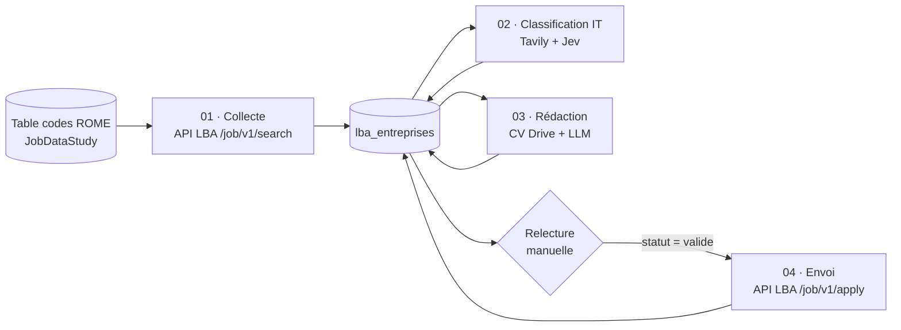

# LBA – Automatisation des candidatures spontanées

> **Vous arrivez ici depuis mon message de candidature ?**
> Bonjour ! Oui, le message que vous avez reçu a été envoyé par ce projet. Je cherche une alternance en informatique (développement d'application, réseau-infra, cybersécurité, QA ...) pour 2026-2027 et, plutôt que d'envoyer des candidatures génériques, j'ai construit cet outil : il repère les entreprises susceptibles de recruter, fait une recherche sur chacune, les trie par spécialité, rédige un message adapté que je relis, puis l'envoie. Le schéma ci-dessous montre comment ça marche, et [`docs/journal.md`](docs/journal.md) raconte la construction, problèmes compris.
> Pour me répondre, il suffit de répondre au message reçu.
> — Gauthier Faisandaz

Pipeline n8n qui repère les entreprises susceptibles de recruter en alternance sur [La bonne alternance](https://labonnealternance.apprentissage.beta.gouv.fr/) (LBA), les classe, rédige un message de candidature personnalisé pour chacune et, à terme, l'envoie via l'API officielle.

Projet personnel mené dans le cadre de ma recherche d'alternance (bassin Lens / Béthune / Lille) en informatique. L'objectif est de faire du volume **sans sacrifier la personnalisation** : chaque message est rédigé à partir de l'activité réelle de l'entreprise et relu avant envoi.

## Architecture

Le suivi repose sur la colonne `statut` de la table : `a_traiter` → `brouillon` → `valide` → `envoyee`.

## Workflows

| Fichier | Rôle | État |
|---|---|---|
| `workflows/01_collecte_entreprises.json` | Interroge l'API LBA pour chaque code ROME suivi, garde les entreprises « candidature spontanée », dédoublonne sur le SIRET et insère uniquement les nouvelles. | Opérationnel |
| `workflows/02_classification_specialite_it.json` | Pour les entreprises informatiques à candidature simplifiée : recherche web (Tavily, annuaires exclus), puis décision par **Jev** (TypeSafe, via OpenRouter) : spécialité (développement, réseau/support, cybersécurité, data, ERP/conseil, ESN généraliste, non IT) avec un score de confiance, et vérification que les résultats web concernent bien la bonne entreprise. | Opérationnel |
| `workflows/03_redaction_candidatures_dev.json` | Pour les entreprises classées « développement » avec une confiance ≥ 0,7 : lit le CV (Google Drive), rédige un message de 120–180 mots avec Claude Haiku 5.5 (OpenRouter) et l'enregistre en brouillon. | Opérationnel, prompt en cours d'affinage |
| Envoi | Envoie les messages validés via `POST /job/v1/apply` (CV en base64, 10 appels/min max). | À construire, en attente de l'habilitation `applications:write` |

### Import

1. Importer les JSON dans n8n.
2. Remplacer les valeurs `REPLACE_ME` (credentials), `ID_TABLE_LBA_ENTREPRISES`, `ID_TABLE_CODES_ROME` et `ID_DU_CV_SUR_GOOGLE_DRIVE`.
3. Créer les credentials : clé API LBA (Header Auth `Authorization: Bearer …`), Tavily, OpenRouter, Google Drive.

## Table `lba_entreprises`

| Colonne | Type | Contenu |
|---|---|---|
| `siret` | string | Clé de dédoublonnage |
| `nom`, `adresse`, `taille`, `secteur_naf` | string | Données LBA |
| `type_opportunite` | string | `candidature_spontanee` (ou `offre`, branche à venir) |
| `code_rome` | string | Premier code ROME sur lequel l'entreprise est remontée |
| `candidature_simplifiee` | boolean | `true` si l'API fournit un `apply.recipient_id` |
| `recipient_id` | string | Destinataire à passer à la route d'envoi |
| `lien_lba` | string | Fiche de l'entreprise sur LBA |
| `site_web`, `telephone` | string | Rarement fournis par LBA ; `site_web` est complété par la classification |
| `specialite` | string | Spécialité choisie par Jev (`inconnu` si les résultats web ne concernent pas l'entreprise) |
| `specialite_confiance` | number | Confiance de Jev (0–1) ; en dessous de 0,7, l'entreprise est à vérifier à la main |
| `resume_activite`, `contexte_web` | string | Résumé et extraits de la recherche web, réutilisés pour la rédaction |
| `classifie_par` | string | Version du modèle ayant classé la ligne |
| `message_brouillon` | string | Message rédigé par le LLM |
| `statut` | string | `a_traiter` / `brouillon` / `valide` / `envoyee` |
| `application_id` | string | Identifiant renvoyé par l'API après envoi |
| `date_collecte` | date | Date d'insertion |

## Ce que j'ai appris de l'API La bonne alternance

- **Recherche** (`GET /api/job/v1/search`, paramètres `romes`, `latitude`, `longitude`, `radius`) : la réponse contient `jobs` (offres) et `recruiters` (entreprises sans offre, jugées susceptibles de recruter).
- **Plafond de 150 résultats par source**, triés par distance : sur un rayon de 50 km on récupère en réalité les 150 entreprises les plus proches par code ROME.
- **Candidature simplifiée = présence de `apply.recipient_id`.** Sur la première collecte (4 codes ROME), 53 % des entreprises en avaient un ; seulement 31 % en comptabilité contre environ 60 % en maintenance et électricité.
- `website` et `phone` sont presque toujours vides : il faut une étape de recherche pour trouver le site.
- Le ciblage par code ROME est large (une recherche « comptabilité » remonte des holdings, de la promotion immobilière…), d'où l'intérêt d'une classification.
- **Envoi** (`POST /api/job/v1/apply`) : nom, prénom, email, téléphone, CV (`.pdf`/`.docx` en base64) et `recipient_id` obligatoires, message facultatif. Requiert l'habilitation `applications:write` (automatique en sandbox, sur demande en production). Limite : 10 appels/minute.
- Usage réservé aux projets non commerciaux.

## Résultats à ce stade

- 26 codes ROME suivis, **1 475 entreprises** collectées.
- Informatique : environ 280 entreprises sous un code ROME IT, plus environ 200 avec un code NAF informatique rangées sous un autre code.
- 85 entreprises informatiques à candidature simplifiée classées par Jev pour environ 0,005 $ au total : 20 réseau/support, 22 hors IT, 12 développement (dont 8 avec une confiance ≥ 0,7), 9 ERP/conseil, 7 ESN généralistes, 4 cybersécurité, 3 data, 8 inconnues.
- Premiers brouillons de messages générés et relus.

Le détail des étapes, des problèmes rencontrés et des choix faits est dans [`docs/journal.md`](docs/journal.md).

## Stack

n8n (data tables, nœuds natifs, chaînes LLM) · API La bonne alternance · Tavily · OpenRouter (Jev de TypeSafe pour la classification, Claude Haiku 5.5 pour la rédaction) · Google Drive
